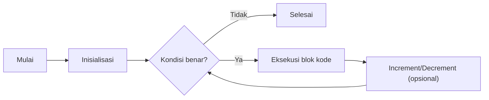
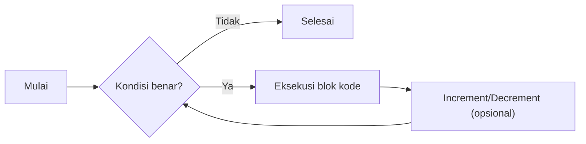
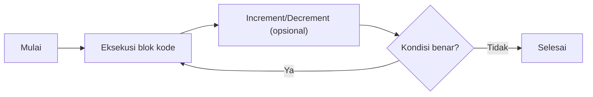
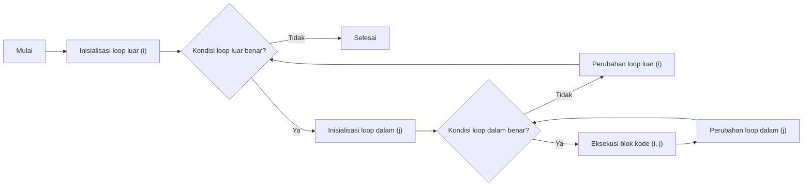

# Perulangan
Perulangan (*looping*) merupakan konsep dasar yang sangat penting dalam pemrograman dan akan **selalu muncul** di berbagai soal kompetitif, mulai dari simulasi, iterasi array, perhitungan matematis, hingga teknik pencarian. Dengan memahami perulangan, kita dapat menulis kode yang efisien dan tidak berulang-ulang secara manual.

### Pengenalan
Mari kita mulai dengan contoh permasalahan sederhana:

> Cetak semua bilangan dari 1 hingga 100.

Jika kita menulis:
```cpp linenums="1"
cout << 1 << endl;
cout << 2 << endl;
// ...
cout << 100 << endl;
```
Maka jelas, ini tidak efisien. Di sinilah perulangan dibutuhkan: kita bisa mengulang proses yang sama sebanyak 100 kali secara otomatis dengan satu baris kode.

### For Loop
for loop digunakan saat kita mengetahui dengan pasti berapa kali perulangan akan dilakukan.


```cpp title="Struktur Umum" linenums="1"
for (inisialisasi; kondisi; perubahan) {
    // blok kode
}
```

```cpp title="Mencetak 1 hingga 5" linenums="1"
for (int i = 1; i <= 5; i++) {
    cout << i << " ";
}
// Output: 1 2 3 4 5
```

Kegunaan umum di pemrograman kompetitif:

- Mengambil n input
- Iterasi array/vector (Akan dipelajari di halaman berikutnya)
- Loop brute-force dengan batas n

#### Flow For Loop


`for loop` sangat berguna ketika jumlah iterasi sudah diketahui sebelumnya. Dengan struktur yang ringkas, kita dapat mengontrol inisialisasi, kondisi, dan perubahan variabel dalam satu baris, sehingga kode menjadi lebih terorganisir dan mudah dibaca. 

Penggunaan `for loop` sangat umum dalam berbagai kasus, seperti mengakses elemen array, melakukan perhitungan berulang, dan menyelesaikan masalah yang membutuhkan iterasi dengan batas tertentu.

!!! notes "Inisiasi"
    Jika anda mendeklarasikan suatu variabel pada `inisiasi` di `for loop`. Variabel tersebut hanya akan dapat diakses pada `for loop` tersebut saja.
    Cek [Variabel Scope C++](https://www.w3schools.com/cpp/cpp_scope.asp) untuk dipelajari lebih lanjut.
    

### While Loop
Digunakan ketika kita tidak tahu pasti berapa kali pengulangan dilakukan, dan hanya berhenti jika suatu kondisi tidak lagi terpenuhi.

```cpp title="Struktur Umum" linenums="1"
while (kondisi) {
    // blok kode
}
```

```cpp title="Mencetak 1 hingga 5" linenums="1"
int i = 1;
while (i <= 5) {
    cout << i << " ";
    i++;
}
// Output: 1 2 3 4 5
```

Kegunaan umum di pemrograman kompetitif:

- Perulangan dengan kondisi yang unik
- Simulasi dengan kondisi dinamis
- Beberapa algoritma umum seperti binary search menggunakannya

#### Flow While Loop


`while loop` sangat berguna ketika jumlah iterasi tidak diketahui sebelumnya dan perulangan bergantung pada kondisi tertentu. Loop ini akan terus berjalan selama kondisi bernilai benar, sehingga cocok untuk kasus di mana proses harus dilakukan hingga syarat tertentu tercapai. 

!!! warning "Infinite Loop"
    Namun, pastikan kondisi pada `while` dapat menjadi salah agar tidak terjadi infinite loop.

### Do-While Loop
do-while menjamin blok kode akan dieksekusi setidaknya satu kali, baru kemudian memeriksa kondisi.

```cpp title="Struktur Umum" linenums="1"
do {
    // blok kode
} while (kondisi);
```

```cpp title="Mencetak 1 hingga 5" linenums="1"
int i = 1;
do {
    cout << i << " ";
    i++;
} while (i <= 5);
// Output: 1 2 3 4 5
```

#### Flow Do While Loop


`do-while loop` memastikan blok kode dijalankan minimal satu kali sebelum kondisi diperiksa. Loop ini cocok digunakan jika proses harus dijalankan setidaknya sekali, misalnya untuk validasi input pengguna. Namun, dalam praktik pemrograman kompetitif, penggunaannya relatif jarang dibandingkan `for` dan `while loop`. Pilih `do-while` jika memang diperlukan eksekusi awal sebelum pengecekan kondisi.

!!! notes "Pendapat Pribadi"
    Jujur selama 4 tahun di pemrograman kompetitif, saya sendiri sangat amat jarang menggunakan ini. `do while` hanya while loops yang pasti dijalankan setidaknya 1 kali.

### Break dan Continue

Dalam perulangan, kita sering kali ingin mengontrol alur eksekusi di dalam loop. Dua perintah penting yang sering digunakan untuk tujuan ini adalah `break` dan `continue`.

#### Break

`break` digunakan untuk **menghentikan** perulangan secara paksa, meskipun kondisi loop masih terpenuhi. Biasanya digunakan ketika kita sudah menemukan apa yang dicari atau ingin keluar dari loop lebih awal.

```cpp title="Contoh penggunaan break" linenums="1"
for (int i = 1; i <= 10; i++) {
    if (i == 5) {
        break; // keluar dari loop saat i == 5
    }
    cout << i << " ";
}
// Output: 1 2 3 4
```

Pada contoh di atas, perulangan berhenti ketika `i` bernilai 5, sehingga hanya mencetak angka 1 sampai 4.

#### Continue

`continue` digunakan untuk **melewati** sisa kode dalam satu iterasi dan langsung melanjutkan ke iterasi berikutnya. Biasanya dipakai jika ada kondisi tertentu yang ingin di-skip.

```cpp title="Contoh penggunaan continue" linenums="1"
for (int i = 1; i <= 5; i++) {
    if (i == 3) {
        continue; // lewati iterasi saat i == 3
    }
    cout << i << " ";
}
// Output: 1 2 4 5
```

Pada contoh di atas, angka 3 tidak dicetak karena saat `i == 3`, perintah `continue` membuat program langsung lanjut ke iterasi berikutnya.

- `break` akan menghentikan seluruh loop.
- `continue` hanya melewati satu iterasi, loop tetap berjalan.
- Keduanya bisa digunakan di semua jenis loop (`for`, `while`, `do-while`).

Penggunaan `break` dan `continue` dapat membuat kode lebih ringkas dan mudah dibaca, terutama saat menangani kasus khusus di dalam perulangan.

### Nested Loop

Nested loop adalah perulangan di dalam perulangan, artinya sebuah loop berada di dalam blok kode loop lain. Konsep ini sangat penting untuk menyelesaikan masalah yang melibatkan data dua dimensi, seperti matriks, tabel, atau pola berbentuk grid.
```cpp linenums="1" title="Struktur Nested Loop"
for (int i = 1; i <= n; i++) {
    for (int j = 1; j <= m; j++) {
        // blok kode yang dijalankan untuk setiap kombinasi i dan j
    }
}
```

```cpp linenums="1" title="Contoh: Mencetak Matriks 3x3"
for (int i = 1; i <= 3; i++) {
    for (int j = 1; j <= 3; j++) {
        cout << "(" << i << "," << j << ") ";
    }
    cout << endl;
}
// Output:
// (1,1) (1,2) (1,3) 
// (2,1) (2,2) (2,3) 
// (3,1) (3,2) (3,3) 
```

### Flow Nested Loops



#### Kegunaan Nested Loop

- Membuat pola (segitiga, persegi, dll)
- Mengakses elemen array 2 dimensi (matriks)
- Simulasi grid atau papan permainan
- Brute-force kombinasi dua variabel


```cpp linenums="1" title="Cetak Segitiga Bintang"
int n = 5;
for (int i = 1; i <= n; i++) {
    for (int j = 1; j <= i; j++) {
        cout << "*";
    }
    cout << endl;
}
// Output:
// *
// **
// ***
// ****
// *****
```

- Jumlah total iterasi = jumlah iterasi loop luar × jumlah iterasi loop dalam.
- Hati-hati dengan kompleksitas waktu, terutama jika nilai n dan m besar.
- Nested loop bisa lebih dari dua tingkat, tetapi semakin dalam biasanya semakin berat secara komputasi.

Nested loop sangat sering digunakan dalam pemrograman kompetitif, terutama untuk masalah pola, matriks, dan kombinasi.

### Kesimpulan
Perulangan adalah konsep fundamental dalam pemrograman yang memungkinkan kita mengeksekusi blok kode secara berulang tanpa menulis kode yang sama berulang kali. Tiga jenis utama perulangan di C++ adalah `for`, `while`, dan `do-while`, masing-masing memiliki kegunaan dan karakteristik tersendiri: `for loop` cocok untuk jumlah iterasi yang pasti, `while loop` untuk kondisi dinamis, dan `do-while loop` untuk memastikan eksekusi minimal satu kali.

Selain itu, perintah `break` dan `continue` sangat berguna untuk mengontrol alur eksekusi di dalam loop, seperti menghentikan loop lebih awal atau melewati iterasi tertentu. Konsep nested loop juga penting untuk menyelesaikan masalah yang meli batkan data dua dimensi atau kombinasi variabel.

Anda akan sering menemukan penggunaan perulangan, break, continue, dan nested loop di berbagai soal pemrograman. Silakan mencoba soal-soal di bawah ini untuk memperdalam pemahaman Anda :3

### Contoh soal TLX 

- [Perkenalan Continue dan Break](https://tlx.toki.id/courses/basic-cpp/chapters/05/problems/C)
- [Mencari Pola 1](https://tlx.toki.id/courses/basic-cpp/chapters/05/problems/E)
- [Mencari Pola 2](https://tlx.toki.id/courses/basic-cpp/chapters/05/problems/F)
- [Mencari Pola 3](https://tlx.toki.id/courses/basic-cpp/chapters/05/problems/G)