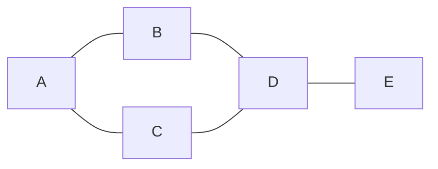

# Menyimpan Graf

Graf merupakan struktur data yang sangat umum dalam pemrograman kompetitif lanjut, mulai dari algoritma traversal, shortest path, cycle detection, tree dan varian lainnya. Sebelum mempelajari algoritma penjelajahan dan komputasi pada graf, kita perlu memahami cara menyimpan graf dalam C++. Berbeda dengan visualisasi manusia, komputer memerlukan representasi khusus untuk graf agar operasi seperti menambah/menghapus edge, *mengiterasi tetangga*, dan *akses data* dapat dilakukan secara optimal.

### Pengenalan Graf
Graf adalah struktur data yang terdiri dari kumpulan simpul (vertex/node) dan sisi (edge) yang menghubungkan simpul-simpul tersebut. Graf dapat berupa:

- **Directed Graph (Digraph)**: Sisi memiliki arah
- **Undirected Graph**: Sisi tidak memiliki arah  
- **Weighted Graph**: Setiap sisi memiliki bobot
- **Unweighted Graph**: Semua sisi memiliki bobot sama



Contoh graf sederhana dengan 5 simpul dan 5 sisi.

### Representasi Graf

Ada tiga cara utama untuk merepresentasikan graf dalam program:

1. **Adjacency Matrix** - Menggunakan matriks 2D
2. **Adjacency List** - Menggunakan array/vector dari list
3. **Edge List** - Menyimpan semua sisi dalam satu list

Mari kita bahas masing-masing representasi beserta kelebihan dan kekurangannya.

## Adjacency Matrix

Adjacency matrix menggunakan matriks 2D untuk merepresentasikan graf, di mana `matrix[i][j]` menunjukkan apakah ada sisi dari simpul `i` ke simpul `j`.

### Implementasi Adjacency Matrix

```cpp title="Unweighted Undirected Graph" linenums="1"
#include <iostream>
#include <vector>
using namespace std;

int main() {
    int n = 5; // jumlah vertex (0-4)
    
    // Membuat adjacency matrix
    vector<vector<int>> adj(n, vector<int>(n, 0));

    // Menambah sisi untuk undirected graph
    // Sisi: (0,1), (0,2), (1,3), (2,3), (3,4)
    adj[0][1] = adj[1][0] = 1;
    adj[0][2] = adj[2][0] = 1;
    adj[1][3] = adj[3][1] = 1;
    adj[2][3] = adj[3][2] = 1;
    adj[3][4] = adj[4][3] = 1;
    
    // Cetak adjacency matrix
    cout << "Adjacency Matrix:" << endl;
    for (int i = 0; i < n; i++) {
        for (int j = 0; j < n; j++) {
            cout << adj[i][j] << " ";
        }
        cout << endl;
    }
    
    // Cek apakah ada sisi antara vertex 0 dan 1
    if (adj[0][1] == 1) {
        cout << "Ada sisi antara vertex 0 dan 1" << endl;
    }

    return 0;
}
```

```cpp title="Weighted Directed Graph" linenums="1"
#include <iostream>
#include <vector>
using namespace std;

int main() {
    int n = 4; // jumlah vertex
    const int INF = 1e9; // nilai untuk "tidak ada sisi"
    
    // Membuat weighted adjacency matrix
    vector<vector<int>> adj(n, vector<int>(n, INF));
    
    // Diagonal elements = 0 (jarak ke diri sendiri)
    for (int i = 0; i < n; i++) {
        adj[i][i] = 0;
    }
    
    // Menambah sisi dengan bobot untuk directed graph
    // Format: adj[from][to] = weight
    adj[0][1] = 10;
    adj[0][2] = 5;
    adj[1][3] = 7;
    adj[2][3] = 3;
    
    // Cetak weighted matrix
    cout << "Weighted Adjacency Matrix:" << endl;
    for (int i = 0; i < n; i++) {
        for (int j = 0; j < n; j++) {
            if (adj[i][j] == INF) {
                cout << "∞ ";
            } else {
                cout << adj[i][j] << " ";
            }
        }
        cout << endl;
    }
    
    return 0;
}
```

**Output Adjacency Matrix:**
```
Adjacency Matrix:
0 1 1 0 0
1 0 0 1 0
1 0 0 1 0
0 1 1 0 1
0 0 0 1 0

Weighted Adjacency Matrix:
0 10 5 ∞
∞ 0 ∞ 7
∞ ∞ 0 3
∞ ∞ ∞ 0
```

### Kompleksitas Adjacency Matrix

| Operasi | Kompleksitas |
|---------|--------------|
| **Space** | O(V²) |
| **Add Edge** | O(1) |
| **Check Edge** | O(1) |
| **Get All Neighbors** | O(V) |
| **Remove Edge** | O(1) |

### Kelebihan dan Kekurangan Matrix

**Kelebihan:**
- Cek keberadaan sisi sangat cepat O(1)
- Implementasi sederhana dan intuitif
- Cocok untuk algoritma yang membutuhkan akses acak ke semua pasangan vertex
- Ideal untuk graf padat (dense graph)

**Kekurangan:**
- Memory usage besar O(V²), tidak efisien untuk graf jarang
- Tidak bisa menyimpan multiple edges antara dua vertex
- Untuk graf besar (V > 10⁴), bisa menyebabkan Memory Limit Exceeded

## Adjacency List

Adjacency list menggunakan array/vector dari list untuk menyimpan graf, di mana setiap indeks menyimpan list dari semua simpul yang terhubung dengannya.

### Implementasi Adjacency List

```cpp title="Unweighted Graph" linenums="1"
#include <iostream>
#include <vector>
using namespace std;

int main() {
    int n = 5; // jumlah vertex (0-4)
    
    // Membuat adjacency list
    vector<int> adj[n];
    
    // Menambah sisi untuk undirected graph
    // Sisi: (0,1), (0,2), (1,3), (2,3), (3,4)
    adj[0].push_back(1); adj[1].push_back(0);
    adj[0].push_back(2); adj[2].push_back(0);
    adj[1].push_back(3); adj[3].push_back(1);
    adj[2].push_back(3); adj[3].push_back(2);
    adj[3].push_back(4); adj[4].push_back(3);
    
    // Cetak adjacency list
    cout << "Adjacency List:" << endl;
    for (int i = 0; i < n; i++) {
        cout << "Vertex " << i << ": ";
        for (int neighbor : adj[i]) {
            cout << neighbor << " ";
        }
        cout << endl;
    }
    
    // Cetak semua tetangga dari vertex 0
    cout << "\nTetangga dari vertex 0: ";
    for (int neighbor : adj[0]) {
        cout << neighbor << " ";
    }
    cout << endl;
    
    return 0;
}
```

!!! notes "For Each Loop"
    `for (int neighbor : adj[i])` adalah contoh dari for each loop yang memungkinkan anda melakukan iterasi pada elemen dari suatu array atau vector.

```cpp title="Weighted Graph" linenums="1"
#include <iostream>
#include <vector>
using namespace std;

int main() {
    int n = 4; // jumlah vertex
    
    // Adjacency list dengan pair<vertex, weight>
    vector<vector<pair<int, int>>> adj(n);
    
    // Menambah sisi dengan bobot (directed graph)
    // Format: adj[from].push_back({to, weight})
    adj[0].push_back({1, 10});
    adj[0].push_back({2, 5});
    adj[1].push_back({3, 7});
    adj[2].push_back({3, 3});
    
    // Cetak weighted adjacency list
    cout << "Weighted Adjacency List:" << endl;
    for (int i = 0; i < n; i++) {
        cout << "Vertex " << i << ": ";
        for (auto edge : adj[i]) {
            cout << "(" << edge.first << "," << edge.second << ") ";
        }
        cout << endl;
    }
    
    return 0;
}
```

!!! notes "Pair"
    `pair<int, int>` adalah struktur data C++ yang dapat menyimpan dua nilai dengan tipe yang bisa berbeda. Dalam konteks weighted graph, kita menggunakan `pair<int, int>` untuk menyimpan pasangan `{vertex, weight}`. Akses nilai pertama dengan `.first` dan nilai kedua dengan `.second`. Contoh: `{3, 7}` berarti edge menuju vertex 3 dengan bobot


**Output Adjacency List:**
```
Adjacency List:
Vertex 0: 1 2
Vertex 1: 0 3
Vertex 2: 0 3
Vertex 3: 1 2 4
Vertex 4: 3

Weighted Adjacency List:
Vertex 0: (1,10) (2,5)
Vertex 1: (3,7)
Vertex 2: (3,3)
Vertex 3:
```

### Kompleksitas Adjacency List

| Operasi | Kompleksitas |
|---------|--------------|
| **Space** | O(V + E) |
| **Add Edge** | O(1) |
| **Check Edge** | O(degree(v)) |
| **Get All Neighbors** | O(degree(v)) |
| **Remove Edge** | O(degree(v)) |

### Kelebihan dan Kekurangan List

**Kelebihan:**
- Memory efficient untuk sparse graph
- Iterasi tetangga sangat cepat
- Paling umum digunakan dalam competitive programming
- Bisa menyimpan multiple edges dan self-loops
- Cocok untuk sebagian besar algoritma graf

**Kekurangan:**
- Cek keberadaan sisi lebih lambat daripada matrix
- Implementasi sedikit lebih kompleks
- Remove edge tidak efisien

## Edge List

Edge list menyimpan semua sisi graf dalam satu struktur data, biasanya vector. Setiap sisi direpresentasikan sebagai struct atau tuple yang berisi informasi simpul-simpul yang terhubung.

### Implementasi Edge List

```cpp title="Unweighted Graph" linenums="1"
#include <iostream>
#include <vector>
using namespace std;

struct Edge {
    int u, v;
};

int main() {
    int n = 5; // jumlah vertex
    vector<Edge> edges;
    
    // Menambah sisi (undirected graph disimpan sekali saja)
    edges.push_back({0, 1});
    edges.push_back({0, 2});
    edges.push_back({1, 3});
    edges.push_back({2, 3});
    edges.push_back({3, 4});
    
    // Cetak semua sisi
    cout << "Edge List:" << endl;
    for (Edge e : edges) {
        cout << e.u << " -- " << e.v << endl;
    }
    
    // Cari semua sisi yang terhubung ke vertex 0
    cout << "\nSisi yang terhubung ke vertex 0:" << endl;
    for (Edge e : edges) {
        if (e.u == 0 || e.v == 0) {
            cout << e.u << " -- " << e.v << endl;
        }
    }
    
    return 0;
}
```

**Output Edge List:**
```
Edge List:
0 -- 1
0 -- 2
1 -- 3
2 -- 3
3 -- 4
```

### Kompleksitas Edge List

| Operasi | Kompleksitas |
|---------|--------------|
| **Space** | O(E) |
| **Add Edge** | O(1) |
| **Check Edge** | O(E) |
| **Get All Neighbors** | O(E) |
| **Remove Edge** | O(E) |

### Kelebihan dan Kekurangan Edge List

**Kelebihan:**
- Memory paling efisien O(E)
- Mudah untuk sort berdasarkan weight
- Simple untuk beberapa algoritma khusus (Kruskal's MST)
- Cocok untuk input/output dalam format edge list

**Kekurangan:**
- Akses tetangga sangat lambat O(E)
- Cek keberadaan sisi sangat lambat O(E)
- Kurang fleksibel untuk kebanyakan algoritma graf
- Tidak efisien untuk operasi yang membutuhkan akses berulang ke tetangga

## Perbandingan Representasi Graf

| Aspek | Adjacency Matrix | Adjacency List | Edge List |
|-------|-----------------|----------------|-----------|
| **Space Complexity** | O(V²) | O(V + E) | O(E) |
| **Add Edge** | O(1) | O(1) | O(1) |
| **Check Edge** | O(1) | O(degree) | O(E) |
| **Get Neighbors** | O(V) | O(degree) | O(E) |
| **Remove Edge** | O(1) | O(degree) | O(E) |

**Keterangan:**
- V = jumlah vertex
- E = jumlah edge
- degree = jumlah tetangga suatu vertex

### Kapan Menggunakan Masing-masing Representasi?

#### Adjacency Matrix
**Gunakan ketika:**
- Graf padat (dense graph) dengan banyak sisi
- Sering perlu cek apakah ada sisi antara dua vertex
- Algoritma Floyd-Warshall untuk all-pairs shortest path
- Graf kecil (V ≤ 1000)
- Butuh akses random ke semua pasangan vertex

```cpp title="Template Matrix untuk CP" linenums="1"
int adj[1000][1000];
bool visited[1000][1000]; // untuk grid/maze
int dist[1000][1000];     // untuk shortest path
```

#### Adjacency List
**Gunakan ketika:**
- Graf jarang (sparse graph) - ini yang paling umum
- Algoritma traversal (BFS, DFS)
- Algoritma shortest path (Dijkstra, Bellman-Ford)
- Sebagian besar soal competitive programming
- Graf besar dengan sedikit sisi per vertex

```cpp title="Template List untuk CP" linenums="1"
vector<int> adj[n + 1];              // unweighted
vector<pair<int, int>> adj[n + 1];   // weighted: pair<vertex, weight>
```

#### Edge List
**Gunakan ketika:**
- Algoritma Kruskal untuk Minimum Spanning Tree
- Union-Find operations
- Perlu sort berdasarkan weight
- Input/output dalam format edge list
- Hanya butuh iterasi semua edges tanpa akses tetangga

```cpp title="Template Edge List untuk CP" linenums="1"
vector<tuple<int, int, int>> edges;  // {weight, u, v}
```

### Tips untuk Competitive Programming

!!! tip "Pilihan Default"
    Gunakan **Adjacency List** sebagai pilihan default. Ini cocok untuk sebagian besar soal graf.

!!! notes "Memory Consideration"
    Untuk V > 10⁴, hindari adjacency matrix karena bisa menyebabkan MLE:
    ```cpp
    // JANGAN: matrix 100000x100000 = 40GB memory!
    int matrix[100000][100000]; 
    
    // GUNAKAN: adjacency list
    vector<vector<int>> adj(n + 1);
    ```

!!! warning "1-indexed vs 0-indexed"
    Banyak soal CP menggunakan vertex 1-indexed:
    ```cpp
    vector<vector<int>> adj(n + 1); // 0..n, gunakan 1..n
    ```
    Jadi hati hati ya :3

### Kesimpulan

Memilih representasi graf yang tepat sangat penting untuk efisiensi program:

- **Adjacency List** → Pilihan default untuk kebanyakan soal CP
- **Adjacency Matrix** → Graf kecil padat atau algoritma khusus
- **Edge List** → Algoritma yang butuh sorting edges (MST)

Memahami trade-off masing-masing representasi akan membantu Anda menulis solusi yang efisien dan menghindari TLE atau MLE. Adjacency list dengan vector adalah yang paling fleksibel dan memory-efficient untuk sebagian besar kasus.