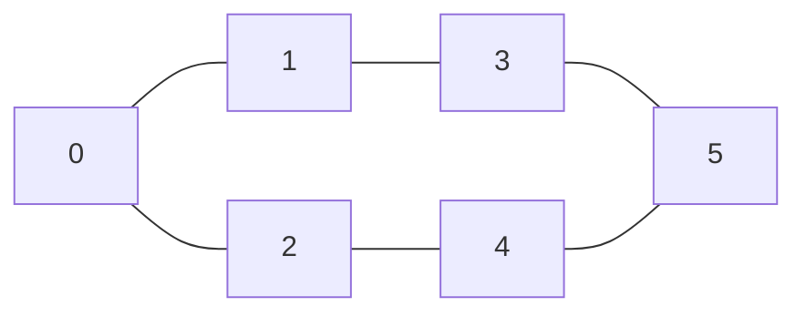
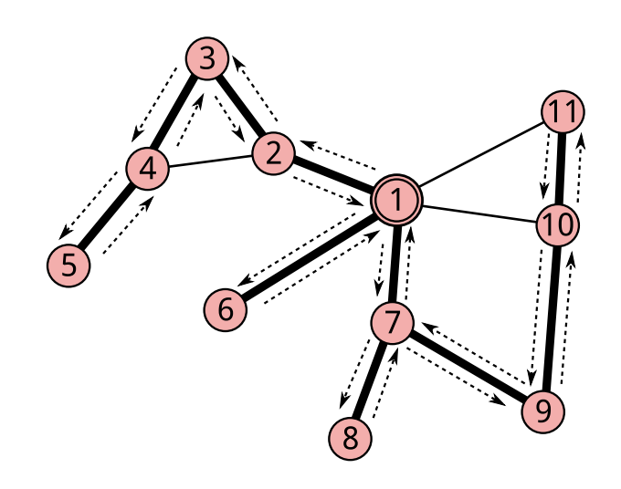
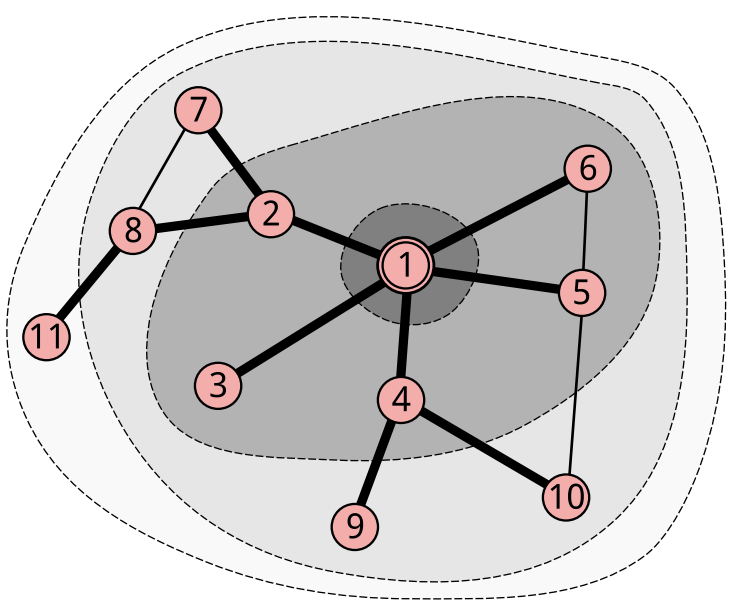

# Penjelajahan Graf

Penjelajahan graf adalah teknik dasar yang wajib dikuasai dalam pemrograman kompetitif. Algoritma seperti BFS dan DFS sering digunakan untuk berbagai tujuan, seperti mencari jalur, mendeteksi siklus, memeriksa keterhubungan, dan menemukan shortest path.

### Pengenalan Penjelajahan Graf
Penjelajahan graf adalah proses mengunjungi semua vertex dalam graf secara sistematis. Ada dua algoritma utama untuk penjelajahan graf:

1. **Breadth-First Search (BFS)** - Penjelajahan melebar
2. **Depth-First Search (DFS)** - Penjelajahan mendalam

Kedua algoritma ini memiliki karakteristik dan kegunaan yang berbeda, sehingga penting untuk memahami kapan menggunakan masing-masing algoritma.

### Konsep Dasar
Sebelum membahas algoritma penjelajahan, kita perlu memahami konsep **visited array** - sebuah array boolean yang menandai vertex mana saja yang sudah dikunjungi untuk menghindari infinite loop.

```cpp title="Setup Dasar" linenums="1"
#include <iostream>
#include <vector>
#include <queue>
#include <cstring> // untuk memset
using namespace std;

// Graf yang akan digunakan dalam contoh
vector<int> adj[6]; // adjacency list untuk 6 vertex (0-5)
bool visited[6];    // array untuk menandai vertex yang sudah dikunjungi

void resetVisited() {
    for (int i = 0; i < 6; i++) {
        visited[i] = false;
    }
    // Alternatif menggunakan memset:
    // memset(visited, false, sizeof(visited));
}
```

Mari kita gunakan graf contoh berikut untuk menjelaskan kedua algoritma:



Graf dengan 6 vertex (0-5) dan 6 edges.

## Depth-First Search (DFS)

DFS adalah algoritma penjelajahan yang mengunjungi vertex secara **mendalam** - artinya kita mengikuti satu jalur sejauh mungkin sebelum backtrack dan mencoba jalur lain.

### Karakteristik DFS:
- Menggunakan **stack** (LIFO - Last In First Out) atau **rekursi**
- Mengunjungi vertex secara mendalam terlebih dahulu
- Cocok untuk deteksi cycle, topological sort
- Backtracking approach

### Implementasi DFS (Rekursif)

```cpp title="DFS Recursive Implementation" linenums="1"
void DFS_recursive(int vertex) {
    visited[vertex] = true;
    cout << vertex << " ";
    
    // Kunjungi semua tetangga yang belum dikunjungi
    for (int neighbor : adj[vertex]) {
        if (!visited[neighbor]) {
            DFS_recursive(neighbor);
        }
    }
}

void DFS(int start) {
    cout << "DFS traversal: ";
    DFS_recursive(start);
    cout << endl;
}
```

### Implementasi DFS (Iteratif)

```cpp title="DFS Iterative Implementation" linenums="1"
void DFS_iterative(int start) {
    stack<int> s;
    vector<bool> vis(6, false);
    
    s.push(start);
    cout << "DFS traversal: ";
    
    while (!s.empty()) {
        int current = s.top();
        s.pop();
        
        if (!vis[current]) {
            vis[current] = true;
            cout << current << " ";

            // Push tetangga ke stack
            for (int neighbor : adj[current]) {
                if (!vis[neighbor]) {
                    s.push(neighbor);
                }
            }
        }
    }
    cout << endl;
}
```

### Langkah-langkah DFS:

<!-- Tempat untuk image explaining DFS behavior -->
*Visualisasi langkah-langkah DFS dimulai dari vertex 0*


[Gambar diambil dari Buku Pemrograman Kompetitif Dasar TOKI](https://osn.toki.id/data/pemrograman-kompetitif-dasar.pdf)

1. **Mulai** dari starting vertex, tandai sebagai visited
2. **Rekursi/Stack**: Untuk setiap tetangga yang belum dikunjungi:
   - Tandai sebagai visited
   - Lakukan DFS dari tetangga tersebut
3. **Backtrack**: Ketika tidak ada tetangga yang belum dikunjungi, kembali ke vertex sebelumnya

### Contoh Eksekusi DFS

```cpp title="Contoh Program DFS" linenums="1"
int main() {
    // Menggunakan graf yang sama
    memset(vis, false, sizeof(vis));
    DFS(0);
    
    return 0;
}
```

**Output:**
```
DFS traversal: 0 1 3 5 4 2
```

### Kompleksitas DFS

| Aspek | Kompleksitas |
|-------|--------------|
| **Time Complexity** | O(V + E) |
| **Space Complexity** | O(V) |


## Breadth-First Search (BFS)

BFS adalah algoritma penjelajahan yang mengunjungi vertex secara **melebar** - artinya kita mengunjungi semua tetangga langsung dari vertex saat ini sebelum pindah ke level yang lebih dalam.

### Karakteristik BFS:
- Menggunakan **queue** (FIFO - First In First Out)
- Mengunjungi vertex berdasarkan **jarak** dari starting vertex
- Menjamin path terpendek dalam unweighted graph
- Level-by-level traversal

### Implementasi BFS

```cpp title="BFS Implementation" linenums="1"
void BFS(int start) {
    queue<int> q;
    
    // Mulai dari vertex start
    visited[start] = true;
    q.push(start);
    
    cout << "BFS traversal: ";
    
    while (!q.empty()) {
        int current = q.front();
        q.pop();
        
        cout << current << " ";
        
        // Kunjungi semua tetangga yang belum dikunjungi
        for (int neighbor : adj[current]) {
            if (!visited[neighbor]) {
                visited[neighbor] = true;
                q.push(neighbor);
            }
        }
    }
    cout << endl;
}
```

### Langkah-langkah BFS:

<!-- Tempat untuk image explaining BFS behavior -->
*Visualisasi langkah-langkah BFS dimulai dari vertex 0*


[Gambar diambil dari Buku Pemrograman Kompetitif Dasar TOKI](https://osn.toki.id/data/pemrograman-kompetitif-dasar.pdf)

1. **Inisialisasi**: Masukkan starting vertex ke queue, tandai sebagai visited
2. **Loop**: Selama queue tidak kosong:
   - Ambil vertex dari depan queue
   - Proses vertex tersebut
   - Masukkan semua tetangga yang belum dikunjungi ke queue
   - Tandai tetangga sebagai visited

### Contoh Eksekusi BFS

```cpp title="Contoh Program BFS" linenums="1"
int main() {
    // Membangun graf contoh
    adj[0].push_back(1); adj[1].push_back(0);
    adj[0].push_back(2); adj[2].push_back(0);
    adj[1].push_back(3); adj[3].push_back(1);
    adj[2].push_back(4); adj[4].push_back(2);
    adj[3].push_back(5); adj[5].push_back(3);
    adj[4].push_back(5); adj[5].push_back(4);
    
    memset(vis, false, sizeof(vis));
    BFS(0);
    
    return 0;
}
```

**Output:**
```
BFS traversal: 0 1 2 3 4 5
```

### Kompleksitas BFS

| Aspek | Kompleksitas |
|-------|--------------|
| **Time Complexity** | O(V + E) |
| **Space Complexity** | O(V) |

- V = jumlah vertex
- E = jumlah edges

### Kapan Menggunakan BFS vs DFS?

#### Gunakan BFS ketika:
- Mencari **shortest path** dalam unweighted graph
- Level-order traversal diperlukan
- Breadth-wise exploration lebih penting
- Solving puzzle dengan minimum moves
- Tree/graph level analysis

#### Gunakan DFS ketika:
- **Cycle detection** dalam graf
- **Topological sorting**
- Exploring all possible paths
- **Connected components** analysis
- **Backtracking** problems
- Tree traversal (pre/post-order)

## Perbandingan BFS vs DFS

| Aspek | BFS | DFS |
|-------|-----|-----|
| **Data Structure** | Queue (FIFO) | Stack/Recursion (LIFO) |
| **Memory Usage** | O(V) | O(V) |
| **Shortest Path** | ✅ Unweighted | ❌ Tidak menjamin |
| **Cycle Detection** | ✅ Possible | ✅ Natural |
| **Connected Components** | ✅ Good | ✅ Excellent |
| **Topological Sort** | ❌ Tidak cocok | ✅ Natural |
| **Maze Solving** | ✅ Optimal path | ✅ Any path |


### Contoh

```cpp title="Template BFS & DFS untuk CP" linenums="1"
#include <iostream>
#include <vector>
#include <queue>
#include <stack>
using namespace std;

const int MAXN = 100005;
vector<int> adj[MAXN];
bool visited[MAXN];

// BFS Template
void bfs(int start) {
    queue<int> q;
    visited[start] = true;
    q.push(start);
    
    while (!q.empty()) {
        int u = q.front();
        q.pop();
        
        // Process vertex u
        cout << u << " ";
        
        for (int v : adj[u]) {
            if (!visited[v]) {
                visited[v] = true;
                q.push(v);
            }
        }
    }
}

// DFS Template
void dfs(int u) {
    visited[u] = true;
    
    // Process vertex u
    cout << u << " ";
    
    for (int v : adj[u]) {
        if (!visited[v]) {
            dfs(v);
        }
    }
}

int main() {
    int n, m; // n = vertices, m = edges
    cin >> n >> m;
    
    for (int i = 0; i < m; i++) {
        int u, v;
        cin >> u >> v;
        adj[u].push_back(v);
        adj[v].push_back(u); // untuk undirected graph
    }
    
    cout << "BFS: ";
    memset(vis, false, sizeof(vis));
    bfs(1);
    cout << endl;
    
    cout << "DFS: ";
    memset(vis, false, sizeof(vis));
    dfs(1);
    cout << endl;
    
    return 0;
}
```

### Tips untuk Competitive Programming

!!! notes "Visited Array"
    Selalu reset visited array saat melakukan multiple traversal:
    ```cpp
    memset(visited, false, sizeof(visited));
    ```

!!! warning "Infinite Loop"
    Pastikan selalu menandai vertex sebagai visited **sebelum** memasukkannya ke queue/stack untuk menghindari duplicate processing.

